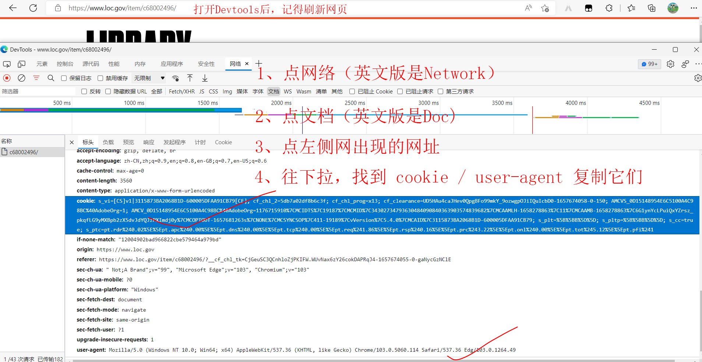
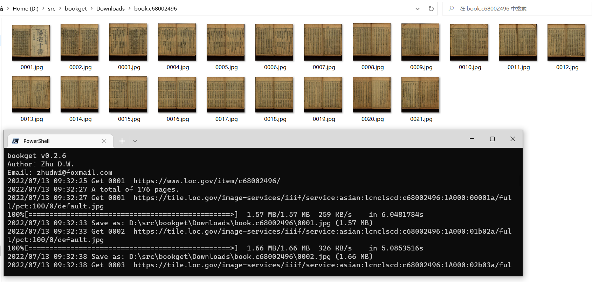
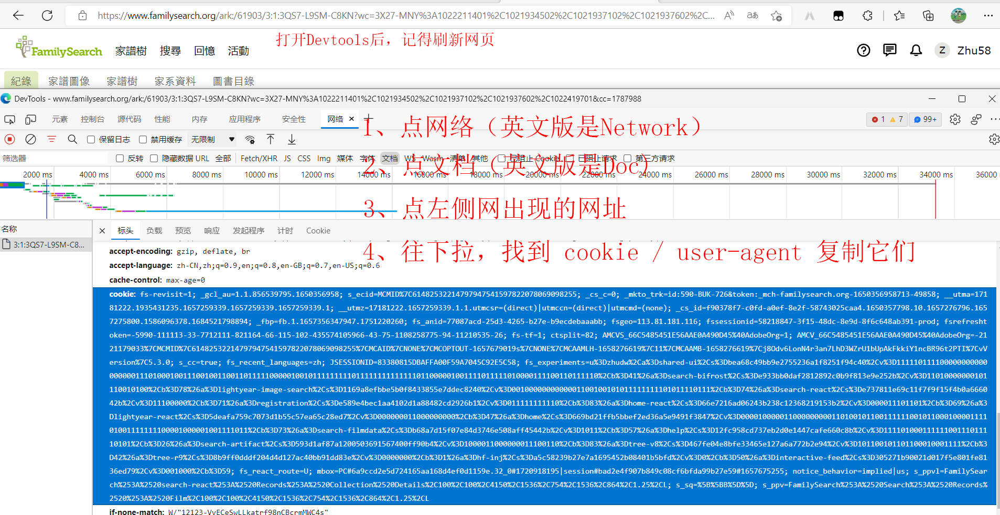
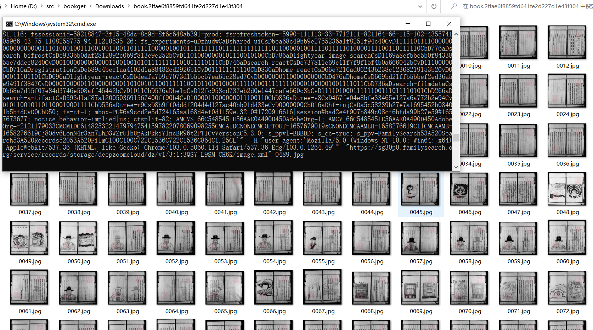

# bookget
bookget 数字图书馆下载工具

#### 自定义用户 cookie
部分网站下载，需要身份鉴权，可以在用户登录后复制浏览器中的cookie，给 bookget 创建 cookie.txt 模拟浏览器下载。

已知需要cookie.txt文件的网站，名单名下：
1. 美国国会图书馆 —— 中国大陆访问
2. familysearch 家谱网
3. 中国广州大典 

#### 使用方法：
1. 在 bookget 件夹下，创建新的文件cookie.txt（用电脑记事本新建一个文件，重命名为cookie.txt）。
2. 文件内容格式如下，一般只需要cookie/user-agent两行即可，user-agent内容可以固定不变，而cookie的内容，需要我们手动从浏览器中获取。

```
user-agent: Mozilla/5.0 (Windows NT 10.0; Win64; x64) AppleWebKit/537.36 (KHTML, like Gecko) Chrome/103.0.5060.114 Safari/537.36 Edg/103.0.1264.49
cookie: 此处替换为你在浏览器中复制的值
```
3. 在从浏览器中获取到正确的cookie后，复制到 cookie.txt 文件中，并保存文件。
4. 运行 bookget 即可自动下载 urls.txt 中填写的图书URL。

#### 例一：美国国会图书馆
1. 以图书 https://www.loc.gov/item/c68002496/ 为例，在浏览器中打开网址。
2. 按键盘快捷键 F12（或Ctrl + Alt + I)，弹出浏览器的【开发者工具】
3. 刷新网页（按F5，或浏览器左上角刷新按钮）
4. 复制 cookie / user-agent  到 cookie.txt 文件中，粘贴并保存文件。（见下图）
      


#### 例二：familysearch.org
1. 以图书 https://www.familysearch.org/ark:/61903/3:1:3QS7-L9SM-C8KN?wc=3X27-MNY%3A1022211401%2C1021934502%2C1021937102%2C1021937602%2C1022419701&cc=1787988
   为例，在浏览器中打开网址（需要用户登录成功后）。
2. 按键盘快捷键 F12（或Ctrl + Alt + I)，弹出浏览器的【开发者工具】
3. 刷新网页（按F5，或浏览器左上角刷新按钮）
4. 复制 cookie / user-agent(此站点只用cookie，不用user-agent亦可)  到 cookie.txt 文件中，粘贴并保存文件。（见下图）
      

5. 特别说明：familysearch 提供的https下载方式，有限速限流，大约10分钟只能下载20MB - 30MB.      
   推荐运行bookget后，到Downloads目录下找到生成的文件夹，手动执行dezoomify-rs.urls.bat(或dezoomify-rs.urls.sh文件).    
   https提供的图片JPG品质45，文件较小，约1MB - 2MB/张。   
   dezoomify-rs.urls下载的JPG品质默认100，文件较大，约8~10MB/张。


